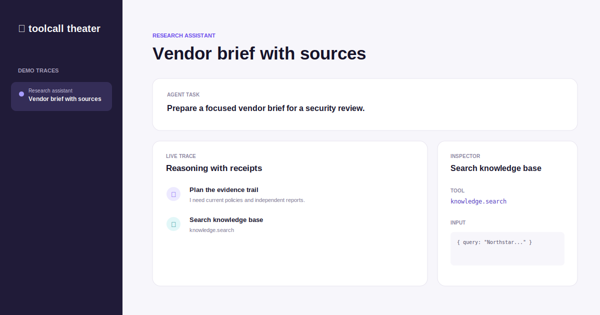

# Toolcall Theater


**A small, inspectable stage for tool-using AI agents.** Toolcall Theater replays realistic agent traces and makes every decision, tool call, approval gate, and evidence item easy to follow.



## Why it exists

Agent demos often hide the part that matters: what the model did, why it did it, and where a human could intervene. This browser-only mini-product turns a trace into a readable operational narrative. It is useful for product demos, onboarding conversations, and design reviews of an agent workflow.

## Features

- Three sample scenarios: research, customer support, and release coordination
- Timed replay with pause, step, and restart controls
- Clear approval gates for consequential actions
- Inspector panel for tool inputs, outputs, and cited evidence
- Run-health indicators for latency, tool calls, and approval status
- Export the current trace as a portable JSON report
- No API key, build step, framework, or network connection required

## Run it

Open `index.html` in a modern browser. For a local server:

```bash
python -m http.server 8080
```

Then visit `http://localhost:8080`.

## How to use it

1. Choose a scenario from the left rail.
2. Press **Play trace** to replay it or **Step** to inspect one event at a time.
3. Select any event to inspect its input, output, and evidence.
4. Press **Approve action** when the trace reaches a human checkpoint.
5. Export the run when you want a shareable snapshot of the trace.

## Project structure

```text
toolcall-theater/
├── index.html        # Product UI
├── styles.css        # Responsive visual system
├── app.js            # Replay controls and rendering
├── model.js          # Trace state and pure helpers
├── data.js           # Realistic demo traces
├── tests/            # Node test coverage for the trace model
└── assets/           # README preview
```

## Verify

```bash
npm test
```

## Future ideas

- import traces from OpenTelemetry or JSONL logs
- compare two agent runs side by side
- redact sensitive fields before exporting
- add a compact timeline embed for incident reports

## License

MIT. See [LICENSE](LICENSE).
